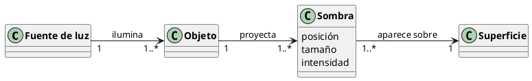

# Reto 001 — Modelado: Una sombra

## 1. Modelo de dominio

Una sombra aparece cuando una fuente de luz ilumina un objeto y este bloquea parte de esa luz, proyectando una región oscura sobre una superficie.

El modelo identifica cuatro conceptos principales:

- **Fuente de luz**
- **Objeto**
- **Sombra**
- **Superficie**

El diagrama de dominio es:

## 2. Glosario

| Término | Definición |
|---|---|
| **Fuente de luz** | Elemento que emite luz (sol, lámpara, vela, etc.). |
| **Objeto** | Elemento opaco o semiopaco que intercepta la luz. |
| **Sombra** | Región donde la luz queda parcial o totalmente bloqueada. Tiene posición, tamaño e intensidad. |
| **Superficie** | Plano o cuerpo sobre el que se proyecta la sombra. |

## 3. Supuestos

1. Una sombra es producida por un objeto que bloquea una fuente de luz.
2. Toda sombra se proyecta necesariamente sobre una superficie.
3. Un objeto puede producir varias sombras si existen varias fuentes de luz.
4. Una fuente de luz puede iluminar varios objetos simultáneamente.
5. No se modelan fenómenos físicos complejos como refracción, difracción o penumbra.

## 4. Decisiones de modelado

**Sombra como clase independiente.** La decisión más discutible es tratar `Sombra` como clase conceptual y no como un atributo de `Objeto`. Se justifica porque la sombra tiene propiedades propias (posición, tamaño, intensidad) y porque el enunciado pide modelar precisamente este concepto, lo que le otorga protagonismo en el dominio.

**Multiplicidades 1..*.** Una fuente de luz que no ilumina ningún objeto no produce sombras y queda fuera del escenario de interés. Análogamente, si un objeto no proyecta ninguna sombra no es relevante al dominio modelado.
