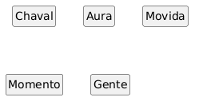
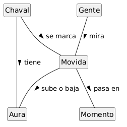
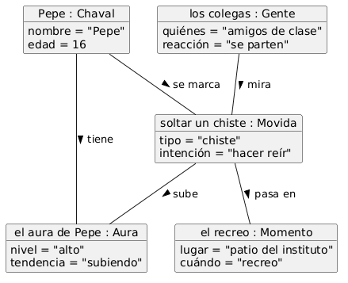

[← Anterior: Una sombra](01_sombra.md) · [🏠 README](../README.md) · [→ Siguiente: El concepto de simpatía](03_simpatia.md)

---

# Reto 001 — Modelado: Farmear aura

## 1 · Estudio del dominio

### Diagrama de clases base

Se identifican los conceptos clave del dominio "farmear aura" tal y como los entendería un adolescente:

### Glosario inicial

| Término | Qué es |
|---|---|
| **Chaval** | Un adolescente cualquiera, el que hace cosas o el que las ve hacer. |
| **Aura** | Lo que los demás piensan de ti. Tu reputación, el rollo que transmites. |
| **Movida** | Algo concreto que hace un chaval: un comentario, un gesto, algo que se marca. |
| **Momento** | Dónde y cuándo pasa la movida: en clase, en el recreo, en una fiesta... |
| **Gente** | Los que están ahí mirando y juzgando lo que haces. El público. |

### Supuestos

1. El aura no es un número fijo; es algo que la gente siente sobre ti.
2. Una misma movida puede molarte a unos y parecerles cringe a otros.
3. El momento importa: lo que mola en una fiesta puede ser ridículo en clase.
4. No hay una fórmula mágica para calcular el aura; es subjetivo.

---

## 2 · Elaboración y estructuración

### Diagrama de clases con relaciones

Se conectan los conceptos usando verbos que diría un adolescente (cliente):

| Relación | Qué significa |
|---|---|
| Chaval — Aura : **tiene** | Cada chaval tiene su propia aura |
| Chaval — Movida : **se marca** | Un chaval se marca una movida (hace algo) |
| Movida — Momento : **pasa en** | Cada movida pasa en un momento concreto |
| Gente — Movida : **mira** | La gente que está ahí mira lo que haces |
| Movida — Aura : **sube o baja** | Según la movida, tu aura sube o baja |

### Diagrama de objetos

Un ejemplo concreto: *"Pepe suelta un chiste en el recreo, los colegas lo miran y su aura sube"*

### Glosario expandido

| Término | Qué es |
|---|---|
| **Chaval** | Un adolescente cualquiera, el que hace cosas o el que las ve hacer. |
| **Aura** | Lo que los demás piensan de ti. Tu reputación, el rollo que transmites. No es algo tuyo solo: depende de lo que piense la gente. |
| **Movida** | Algo concreto que hace un chaval: un comentario, un gesto, algo que se marca. Es lo que la gente ve y juzga. |
| **Momento** | Dónde y cuándo pasa la movida: en clase, en el recreo, en una fiesta... El contexto que hace que algo mole o sea cringe. |
| **Gente** | Los que están ahí mirando y juzgando lo que haces. El público. No tienen por qué ser desconocidos; son otros chavales. |
| **se marca** | Cuando un chaval hace algo, "se marca una movida". |
| **sube o baja** | El efecto que tiene una movida en tu aura. Si la gente flipa, sube. Si les parece cringe, baja. |

---

[← Anterior: Una sombra](01_sombra.md) · [🏠 README](../README.md) · [→ Siguiente: El concepto de simpatía](03_simpatia.md)
