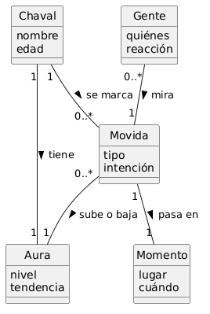
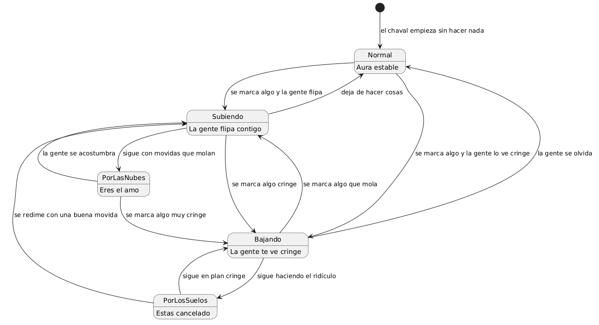

[← Anterior: Una sombra](01_sombra.md) · [🏠 README](../README.md) · [→ Siguiente: El concepto de simpatía](03_simpatia.md)

---

# Reto 001 — Modelado: Farmear aura

## 1 · Estudio del dominio

### Diagrama de clases base

Se identifican los conceptos clave del dominio "farmear aura" tal y como los entendería un adolescente (el cliente):

### Glosario inicial

| Término | Qué es |
|---|---|
| **Chaval** | Un adolescente cualquiera, el que hace cosas o el que las ve hacer. |
| **Aura** | Lo que los demás piensan de ti. Tu reputación, el rollo que transmites. |
| **Movida** | Algo concreto que hace una persona: un comentario, un gesto, algo que se marca. |
| **Momento** | Dónde y cuándo pasa la movida: en clase, en el recreo, en una fiesta... |
| **Gente** | Los que están ahí mirando y juzgando lo que haces. El público. |

### Supuestos

1. El aura no es un número fijo, es algo que la gente siente sobre ti.
2. Una misma movida puede "molarle" a unos y parecerle "cringe" a otros.
3. El momento importa: lo que "mola" en una fiesta puede ser "ridículo" en clase.
4. No hay una fórmula mágica para calcular el aura, es subjetivo.

---

## 2 · Elaboración y estructuración

### Diagrama de clases con relaciones

Se conectan los conceptos usando verbos que diría un adolescente (cliente):

| Relación | Qué significa |
|---|---|
| Chaval — Aura : **tiene** | Cada chaval tiene su propia aura |
| Chaval — Movida : **se marca** | Un chaval se marca una movida (hace algo) |
| Movida — Momento : **pasa en** | Cada movida pasa en un momento concreto |
| Gente — Movida : **mira** | La gente que está ahí mira lo que haces |
| Movida — Aura : **sube o baja** | Según la movida, tu aura sube o baja |

### Diagrama de objetos

Un ejemplo concreto: *"Pepe suelta un chiste en el recreo, los colegas lo miran y su aura sube"*

### Glosario expandido

| Término | Qué es |
|---|---|
| **Chaval** | Un adolescente cualquiera, el que hace cosas o el que las ve hacer. |
| **Aura** | Lo que los demás piensan de ti. Tu reputación, el "rollo" que transmites. No es algo tuyo solo: depende de lo que piense la gente. |
| **Movida** | Algo concreto que hace un chaval: un comentario, un gesto, algo que se marca. Es lo que la gente ve y juzga. |
| **Momento** | Dónde y cuándo pasa la movida: en clase, en el recreo, en una fiesta... El contexto que hace que algo mole o sea "cringe". |
| **Gente** | Los que están ahí mirando y juzgando lo que haces. El público. No tienen por qué ser desconocidos; son otros chavales. |
| **se marca** | Cuando un chaval hace algo, "se marca una movida". |
| **sube o baja** | El efecto que tiene una movida en tu aura. Si la gente flipa, sube. Si les parece "cringe", baja. |

---

## 3 · Refinamiento y detalle

### Diagrama de clases con multiplicidades y atributos

Se añaden multiplicidades (cuántos de cada cosa) y atributos (qué datos tiene cada concepto):

| Multiplicidad | Qué quiere decir |
|---|---|
| Chaval **1** — **1** Aura | Cada chaval tiene exactamente un aura |
| Chaval **1** — **0..*** Movida | Un chaval puede marcarse ninguna, una o muchas movidas |
| Movida **1** — **1** Momento | Cada movida pasa en un momento concreto |
| Gente **0..*** — **1** Movida | Una movida puede ser mirada por nadie o por mucha gente |
| Movida **0..*** — **1** Aura | Un aura se ve afectada por muchas movidas a lo largo del tiempo |

### Diagrama de estados del Aura

El aura de un chaval no es fija: va cambiando según lo que haga y cómo reaccione la gente:

| Estado | Qué significa |
|---|---|
| **Normal** | Aura estable, ni sube ni baja. El chaval no se ha marcado nada. |
| **Subiendo** | La gente empieza a flipar contigo. Vas bien. |
| **Bajando** | La gente empieza a verte cringe. Vas mal. |
| **PorLasNubes** | Eres el amo. Todo lo que haces mola. |
| **PorLosSuelos** | Estás cancelado. Todo lo que haces está mal. |

### Glosario refinado

| Término | Qué es |
|---|---|
| **Chaval** | Un adolescente cualquiera (nombre, edad). Puede marcarse movidas y tiene un aura. |
| **Aura** | La reputación de una persona (nivel, tendencia). Depende de sus movidas y de lo que opine la gente. No es algo fijo: tiene estados (normal, subiendo, bajando, por las nubes, por los suelos). |
| **Movida** | Algo concreto que hace un chaval (tipo, intención). Un chaval se marca 0 o muchas. Cada una pasa en un momento y puede ser mirada por gente. |
| **Momento** | El contexto (lugar, cuándo). Cada movida ocurre en exactamente uno. |
| **Gente** | Los que miran (quiénes, reacción). Pueden ser 0 o muchos mirando una movida. |

---

[← Anterior: Una sombra](01_sombra.md) · [🏠 README](../README.md) · [→ Siguiente: El concepto de simpatía](03_simpatia.md)
