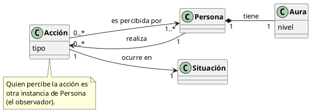

# Reto 001 — Modelado: Farmear aura

## 1. Modelo de dominio

Se entiende "farmear aura" como realizar acciones con el propósito (consciente o no) de aumentar la percepción positiva que otras personas tienen de uno mismo.

Los conceptos principales son:

- **Persona**
- **Aura**
- **Acción**
- **Situación**

El modelo es:

## 2. Glosario

| Término | Definición |
|---|---|
| **Aura** | Percepción positiva o prestigio que una persona genera en su entorno social. |
| **Farmear aura** | Realizar acciones orientadas a aumentar el aura percibida. |
| **Acción** | Comportamiento concreto llevado a cabo por una persona. |
| **Situación** | Contexto social en el que ocurre una acción (puede amplificar o reducir su impacto). |

## 3. Supuestos

1. El aura no es una propiedad física, sino una percepción social construida por otros.
2. Una acción puede aumentar, disminuir o no modificar el aura.
3. El efecto de una acción puede variar según quién la percibe y en qué situación ocurre.
4. El aura tiene un nivel que cambia como consecuencia de las acciones realizadas.
5. No se establece una fórmula matemática para calcular el nivel de aura.

## 4. Decisiones de modelado

**Aura como clase con composición.** Se modela `Aura` como clase compuesta por `Persona` (composición `*--`) porque el aura no existe independientemente de una persona; es una propiedad emergente de ella. Podría haberse modelado como atributo, pero representarla como clase permite que tenga su propio atributo `nivel` y facilita añadirle comportamiento futuro.

**Situación como clase propia.** Se podría haber modelado como atributo de `Acción`, pero al representarla como clase se permite que la misma situación afecte a varias acciones, capturando mejor la idea de que el contexto es un factor externo y compartido.
