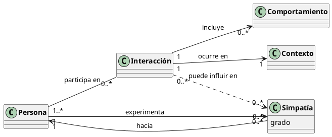

# Reto 001 — Modelado: El concepto de simpatía

## 1. Modelo de dominio

La simpatía se entiende como una percepción favorable que una persona tiene hacia otra. No se considera que alguien sea simpático de forma absoluta: la simpatía es relacional y puede variar según quién la percibe y el contexto en que se produce.

Los conceptos principales son:

- **Persona**
- **Simpatía**
- **Interacción**
- **Comportamiento**
- **Contexto**

El modelo es:

## 2. Glosario

| Término | Definición |
|---|---|
| **Persona** | Individuo que participa en relaciones sociales. |
| **Simpatía** | Percepción favorable que una persona tiene hacia otra; tiene un grado y puede cambiar. |
| **Interacción** | Encuentro o relación entre dos o más personas. |
| **Comportamiento** | Forma en que una persona actúa durante una interacción. |
| **Contexto** | Circunstancias externas (lugar, momento, cultura) en las que sucede una interacción. |

## 3. Supuestos

1. La simpatía es relacional: es siempre de una persona *hacia* otra, no una propiedad absoluta.
2. La simpatía puede ser asimétrica: A puede ser simpático para B sin que B lo sea para A.
3. La simpatía puede cambiar con el tiempo como consecuencia de nuevas interacciones.
4. Las interacciones y los comportamientos que ocurren en ellas pueden influir en la simpatía percibida.
5. No se establece una fórmula objetiva para determinar cuándo alguien es "simpático".

## 4. Decisiones de modelado

**Simpatía como clase, no como atributo.** Se ha optado por representar `Simpatía` como clase independiente en lugar de como un atributo booleano o numérico de `Persona`. El motivo es que la simpatía no pertenece a una persona sino a la *relación* entre dos personas. Modelarla como clase permite que tenga su propio atributo `grado` y que participe en relaciones con otros conceptos (como las interacciones).

**Relación Interacción → Simpatía.** En la versión anterior, los dos subgrafos del modelo (el de `Simpatía` y el de `Interacción`) estaban desconectados entre sí. Se ha añadido una dependencia punteada `Interacción ..> Simpatía : puede influir en` para capturar el hecho central del dominio: las interacciones son el mecanismo a través del cual se genera o modifica la simpatía. Se usa una relación de influencia (punteada) y no una asociación fuerte porque el efecto no es determinista.

**No existe clase `Simpático`.** Se considera que "simpático" es un adjetivo derivado de percibir un `grado` alto de `Simpatía`; no es un tipo de persona sino un estado relacional. Crear una clase `Simpático` introduciría una categoría absoluta que el modelo rechaza explícitamente.
